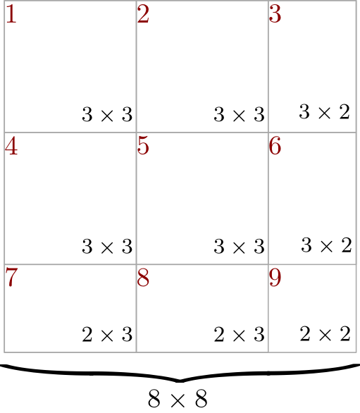

# Project Phase-1 Report

#### Team baseBase

- Rudransh Pratap Singh [2020111007]
- A Kishore Kumar [2020101126]
- Abhijnan Vegi [2020101004]

---

## Summary of Modifications

**Additions/Modifications in Source Code:**

```
src
├── executors
├── print.cpp (Modified to support Matrix printing)
├── export.cpp (Modified to support Matrix exporting)
├── rename.cpp (Modified to support Matrix renaming)
├── transpose.cpp (Added to support Matrix transposition)
├── checksymmetry.cpp (Added to support Matrix symmetry checks)
├── compute.cpp (Added to support Matrix computation)
├── load.cpp (Modified to support Matrix loading)
├── matrix.cpp (Added)
├── matrix.h (Added)
├── tableCatalogue.cpp (Modified)
├── tableCatalogue.h (Modified)
├── syntacticParser.cpp (Modified)
├── syntacticParser.h (Modified)
├── semanticParser.cpp (Modified)
├── semanticParser.h (Modified)
├── executor.cpp (Modified)
├── executor.h (Modified)
├── global.h (Modified)
```


## Page Design

The Page Design operates as follows: The Matrix is divided into 15x15 blocks, each stored in an individual file. Blocks are arranged in row-major order, with the number of blocks calculated as ceil(n/15) * ceil(n/15).

This design ensures efficiency for transpose, symmetry check, and computation operations, as described below:

- For diagonal blocks, transpose is computed directly.
- For off-diagonal blocks, block swapping is performed before computing the transpose for each block.



---

### LOAD Command

For the LOAD Command, we modified the `tableCatalogue` to support both tables and matrices. We added the `insertMatrix` function, which adds matrices to the tableCatalogue.

```cpp
void executeLOAD_MATRIX()
{
    logger.log("executeLOAD");
    Matrix *matrix = new Matrix(parsedQuery.loadRelationName);
    if (matrix->load())
    {
        tableCatalogue.insertMatrix(matrix);
        cout << "Loaded Matrix. Dimensions: " << matrix->columnCount << endl;
    }
    return;
}
```

We then modified the `load.cpp` file to support the matrix load operations, and added the declarations for the functions
in the `semanticParser.h/semanticParser.cpp`, `syntacticParser.h/syntacticParser.cpp`, and `executor.h/executor.cpp`
files.

Also since the syntax for the MATRIX commands follows the format `COMMAND MATRIX <MATRIX_NAME>`. We added support for 3
arguments in the `syntacticParser.cpp` file.

Blocks read = 0
Blocks written = ceil(n/15)*ceil(n/15)
Blocks accessed = ceil(n/15)*ceil(n/15)

### PRINT Command

We made similar changes to the PRINT Command as well. We first added the `Matrix::print()` function in `matrix.cpp`
which prints the matrix in the required format.
We then modified the `print.cpp` file to support the matrix print operations, and added the declarations for the
functions
in the `semanticParser.h/semanticParser.cpp`, `syntacticParser.h/syntacticParser.cpp`, and `executor.h/executor.cpp`
files.

Blocks read = ceil(n/15)*ceil(n/15)
Blocks written = 0
Blocks accessed = ceil(n/15)*ceil(n/15)

### RENAME Command

Implementing rename requires us to not only change the name of the matrix in the Table Catalogue, but we also need to
rename the pages corresponding to the matrix, since the pages are named as `<matrixname>_Page_<pageindex>`. Therefore we
first added support for the command by adding the `TableCatalogue::renameMatrix()` function in `tableCatalogue.cpp`.
This function changes the name of the matrix from `oldMatrixName` to `newMatrixName` in the Table Catalogue. It also
calls the `Matrix::rename` function which renames the pages corresponding to the matrix in memory and on disk. It does this by calling the
`BufferManager::renameFile` function.

Blocks read = 0
Blocks written = 0
Blocks accessed = 0

### EXPORT Command

The Export Commands works similar to the PRINT command, except that it writes the output to a file by the name
of `MATRIX_NAME.csv`. We implemented the `Matrix::makePermanent` function which writes the matrix to a file with the
appropriate name.

Blocks read = ceil(n/15)*ceil(n/15)
Blocks written = 0
Blocks accessed = ceil(n/15)*ceil(n/15)

## CHECKSYMMETRY Command

The CHECKSYMMETRY Command is realized through the `Matrix::checkSymmetry` method, which systematically checks matrix symmetry. It iterates through matrix pages, verifying symmetry by examining two pages, A and B, positioned symmetrically across the diagonal. These pages are swapped during transposition, and symmetry is affirmed if $A^T$ equals B.

Block Metrics:
- Blocks Read: `ceil(n/15) * ceil(n/15)`
- Blocks Written: `0`
- Blocks Accessed: `ceil(n/15) * ceil(n/15)`

## TRANSPOSE Command

The TRANSPOSE Command works similarly to CHECKSYMMETRY but differs by executing an in-place page swapping operation within the matrix. This process avoids equality verification by directly copying the target page to its destination for storing the transposed data. The operation is orchestrated using the `Matrix::transpose` function with support from `BufferManager::transposeMatrixPage`.

Block Metrics:
- Blocks Read: `ceil(n/15) * ceil(n/15)`
- Blocks Written: `ceil(n/15) * ceil(n/15)`
- Blocks Accessed: `2 * ceil(n/15) * ceil(n/15)`

## COMPUTE Command

The COMPUTE Command follows a parallel processing approach, where two symmetrically positioned pages across the matrix's diagonal undergo computational processing and are then stored in persistent storage. This functionality is implemented within the `Matrix::compute` method.

Block Metrics:
- Blocks Read: `ceil(n/15) * ceil(n/15)`
- Blocks Written: `ceil(n/15) * ceil(n/15)`
- Blocks Accessed: `2 * ceil(n/15) * ceil(n/15)`

### Note
All the block counts are given based on the input being an nxn matrix and block size = 1

---

## Learnings

- Tradeoff between memory usage and disk reads/latency
- Optimal data representation for efficient operations


## Assumptions
- Input is always a valid square matrix
- Matrix has at least one element
- Block size is big enough to fit at least one integer
- Editing file name does not count as a block write

---

## Contributions

### Rudransh Pratap Singh

- Implemented Matrix and MatrixCatalogue classes
- Implemented `EXPORT` command
- Report

### A Kishore Kumar

- Implemented `TRANSPOSE` , `CHECKSYMMETRY` and `COMPUTE` commands

### Abhijnan Vegi

- Implemented `LOAD` , `PRINT` and `RENAME` commands
- Adjusted Page Design and matrix representation

